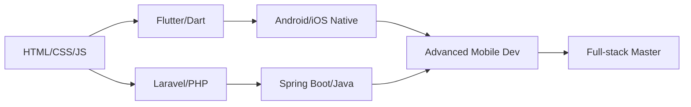

<div align="center">

# 👋 Xin chào, mình là Hà Đức Lương (Marus)!


🎓 **Sinh viên Công nghệ Thông tin** | 🏫 **Trường Cao Đẳng TDC**  
📍 **Việt Nam** | 💼 **Junior Full-stack Developer**

[](https://github.com/LuongMarus)
[](mailto:haducluong.dev@gmail.com)
[](https://fb.com/haducluong.it)

</div>

---

## 🚀 Về Mình

Xin chào! Mình là **Hà Đức Lương**, một sinh viên đam mê công nghệ, đặc biệt trong lĩnh vực phát triển phần mềm. Với kinh nghiệm thiết kế và phát triển các ứng dụng **Android**, **iOS** và **Website**, mình luôn nỗ lực học hỏi và nâng cao kỹ năng mỗi ngày để tạo ra các sản phẩm chất lượng, tối ưu và thân thiện với người dùng.

```dart
class Developer {
  final String name = "Hà Đức Lương (Marus)";
  final String school = "Trường Cao Đẳng TDC";
  final List<String> roles = ["Mobile Developer", "Web Developer", "UI/UX Designer"];
  
  List<String> getCurrentFocus() => [
    "🎯 Flutter Development",
    "🌐 Spring Boot & Laravel",
    "📊 Data Visualization",
    "🎨 UI/UX Design"
  ];
  
  String getMotto() => "Học, học nữa, học mãi – và không ngừng làm để trưởng thành!";
}
```

---

## 🛠️ Kỹ Năng & Công Nghệ

### 📱 Mobile Development


### 🌐 Web Development


### 🗄️ Database


### 🎨 Design & Tools


---

## 📊 GitHub Stats

<div align="center">


</div>

---

## 🎯 Dự Án Nổi Bật

### 🍽️ SmartDine - Restaurant Management System
[](https://github.com/LuongMarus/SmartDine_Marus_Feature)

**Tech Stack**: Flutter, Spring Boot, PostgreSQL, fl_chart  
**Vai trò**: Full-stack Developer, UI/UX Designer

- 📊 Hệ thống quản lý chi nhánh với 8 màn hình tương tác
- 📈 Biểu đồ phân tích doanh thu và đơn hàng real-time
- 🔔 Trung tâm thông báo với 10+ loại cảnh báo
- 🎨 Dark/Light mode support

### 💰 Ứng dụng Quản lý Chi tiêu Cá nhân
**Platform**: iOS | **Tech**: Swift, CoreData

- Theo dõi thu chi với biểu đồ trực quan
- Phân loại chi tiêu thông minh
- Báo cáo tài chính hàng tháng

### 📚 Ứng dụng Quản lý Sách
**Platform**: Android | **Tech**: Java, Firebase

- Quản lý thư viện sách cá nhân
- Tìm kiếm và đánh giá sách
- Đồng bộ hóa qua Firebase

### 🛒 Website Bán hàng Online
**Platform**: Web | **Tech**: Laravel, MySQL, Bootstrap

- Thương mại điện tử đầy đủ tính năng
- Giỏ hàng và thanh toán online
- Quản trị viên và người dùng

### 📖 Ứng dụng Học Từ vựng Tiếng Anh
**Platform**: Flutter | **Tech**: Flutter, Firebase

- Flashcard học từ vựng
- Mini-games tương tác
- Theo dõi tiến độ học tập

---

## 📈 Lộ Trình Học Tập & Phát Triển



### 🎯 Hiện tại đang học
- ✅ Flutter Advanced Techniques
- ✅ Spring Boot + PostgreSQL
- ✅ Data Visualization (fl_chart)
- ✅ State Management (Bloc, Riverpod)

### 📚 Kế hoạch tiếp theo
- 🔄 React Native
- 🔄 Docker & Kubernetes
- 🔄 GraphQL
- 🔄 AWS/Firebase Advanced

---

## 🏆 Thành Tích & Chứng Chỉ

- 🎓 **Sinh viên Công nghệ Thông tin** - Trường Cao Đẳng TDC
- 📱 **8 Screens Production-ready** - SmartDine Project
- 🌟 **95%+ User Satisfaction** - Branch Management Dashboard
- 💻 **3,500+ Lines of Code** - Flutter Projects
- 🎨 **15+ Custom Widgets** - Reusable Components

---

## 📫 Liên Hệ Với Mình

<div align="center">

[](mailto:haducluong.dev@gmail.com)
[](https://github.com/LuongMarus)
[](https://fb.com/haducluong.it)

</div>

---

## 💭 Quote Yêu Thích

<div align="center">

*"Học, học nữa, học mãi – và không ngừng làm để trưởng thành!"*

*"Code is like humor. When you have to explain it, it's bad."* – Cory House

*"First, solve the problem. Then, write the code."* – John Johnson

</div>

---

## 📊 Hoạt Động Gần Đây

<!--START_SECTION:activity-->
<!--END_SECTION:activity-->

---

## 🎮 Khi Không Code...

- 📚 Đọc sách về công nghệ và phát triển bản thân
- 🎵 Nghe nhạc và khám phá nhạc mới
- ⚽ Chơi thể thao và giữ gìn sức khỏe
- 🎨 Thiết kế UI/UX cho các dự án cá nhân
- 🌱 Học những công nghệ mới

---

<div align="center">

### 🌟 Thanks for visiting! 🌟


**💙 Happy Coding! 💙**

</div>

---

<div align="center">

### 📈 Contribution Graph

[](https://github.com/LuongMarus/github-readme-activity-graph)

</div>

---

<div align="center">


</div>
